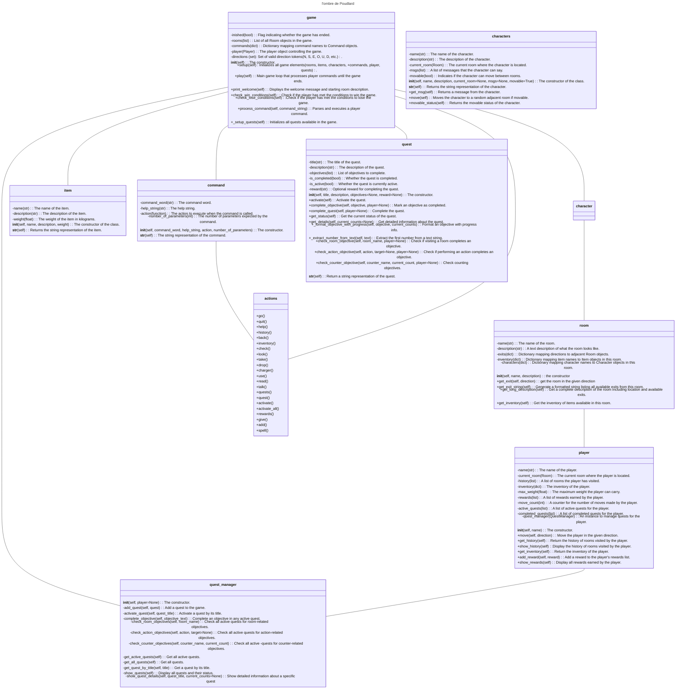

####**Le guide utilisateur :** 

  

  

##**Comment installer votre jeu :** 

Il faut écrire dans le terminal : 

§ git pull (pour avoir la dernière version du jeu),
§ python game.py ou python3 game.py sur macOS (pour lancer le programme et donc pour lancer le jeu),
entrer son nom de joueur,
lire les instructions.

  

  

##**Sa description :** 

  

#L’univers, le scénario : 

  

Vous incarnez un sorcier qui se rend à sa nouvelle année de Poudlard. 
Le jeu débute donc à la gare, avec comme première mission de choisir le bon train et ne pas oublier ses affaires.
En arrivant à Poudlard, vous comprenez petit à petit que quelque chose se passe… Une créature rôde dans Poudlard ! 
C’est à vous de trouver quelle est cette créature, comment elle est arrivée là, comment la vaincre et sauver Poudlard ! 
Pour cela, explorez votre environnement dans les moindre détails et résolvez les quêtes.

  

#Salles avec leurs objets et PNJ : 

Certains PNJ bougent, d’autres non. Ceux qui bougent ont l’indication “bouge” et sont placés dans la salle où ils se trouvent lors de l’initialisation de jeu.

  

**La gare (gare)**

- La valise du joueur (valise)
- La baguette magique du joueur (baguette)

  

**Le train direction Poudlard (train)**

- Des bonbons (bonbons)
- L’élève Ron (Ron) bouge
- L’élève Harry (Harry) bouge
- L’élève Cédric (Cedric)

  

**Le train direction Durmstrang (wrongtrain)**

**Le train direction ESIEE Paris (noisytrain)**

**L’entrée de Poudlard (entree)**

- Une chouette (chouette)

  

**La bibliothèque (bibliotheque)**

- Un livre sur les loups (loups)
- Un livre sur les trolls (trolls)
- Un livre sur les acromentules (acromentules)
- Un livre sur les détraqueurs (detraqueurs)
- Un livre sur les fantômes (fantomes)
- L’élève Hermione (Hermione) bouge

  

La salle de classe (classe)

Un livre sur les sortilèges (sortilèges)

Un chaudron (chaudron)

Une mandragore (mandragore)

Le professeur Lupin (Lupin)

Le professeur Rogue (Rogue)

  

La grande salle (banquet)

Des cookies (cookies)

Le directeur Dumbledore (Dumbledore)

La professeur Mcgonagall (Mcgonagall) bouge

L’infirmière Pomfresh (Pomfresh) bouge

Le Choixpeau Magique (Choixpeau)

  

La cabane d’Hagrid (cabane)

Un parchemin (parchemin)

Une paire de bottes (bottes)

Un poil de licorne (licorne)

Le demi-géant Hagrid (Hagrid)

  

Le chemin (chemin)

Un bout de tissu (tissu)

  

Les dortoirs (dortoirs)

Une écharpe de Gryffondor (echarpe)

Un chapeau de sorcier (chapeau)

Un journal intime (journal)

Une paire de chaussettes (chaussettes)

L’élève Drago ( Drago) bouge

L’élève Luna (Luna)

  

La forêt interdite (foret)                                                            

Une branche (branche)

Le centaure Firenze (Firenze)

Le détraqueur (Détraqueur)

  

Les cachots (cachots)

Une larmes de phénix (phenix)

L’elfe Dobby (Dobby)

  

Les escaliers (escalier)

Le Baron Sanglant (Fantome) bouge

  

Le palier (palier)

Un bout de papier (papier)

  

Le couloir (couloir)

Un portoloin (portoloin)

  

Les conditions de victoires/défaites : 

  

Victoires : 

Pour gagner le jeu, le joueur doit effectuer 1 quêtes obligatoirement, qui demande de faire les 5 quêtes suivantes : 

Petit Voyageur

Grand Explorateur

Qui est l’ombre

Libérateur d’Elfe

Combattant Courageux

  

Défaites : 

Le joueur perd s’il se trompe de train lorsqu’il est dans la gare. Il y a 3 choix possibles : 1 seul train mène à Poudlard.                                                                     

  

Les commandes disponibles : 

  

    - help : afficher cette aide

    - quit : quitter le jeu

    - go <direction> : se déplacer dans une direction cardinale (N, E, S, O) ou monter (U) ou  descendre (D)

    - history : afficher l'historique des pièces visitées

    - back : revenir à la pièce précédente

    - inventory : afficher l'inventaire du joueur

    - look : regarder autour de soi dans la pièce actuelle

    - take : prendre un objet dans la pièce actuelle

    - drop : déposer un objet de l'inventaire du joueur dans la pièce actuelle

    - check : examiner un objet de l'inventaire du joueur

    - charger : charger une pièce dans le portoloin

    - use : utiliser un objet de l'inventaire du joueur

    - read : lire un objet de l'inventaire du joueur

    - talk : parler à un personnage dans la pièce actuelle

    - quests : afficher les quêtes en cours et leurs statuts

    - rewards : afficher les récompenses obtenues

    - quest <titre de la quête> : afficher les détails d'une quête spécifique

    - activate : activer une quête

    - activate\_all : activer toutes les quêtes

    - give < objet + to + personnage > : donner un objet à un personnage dans la pièce actuelle

    - spell : lancer un sort avec un objet de l'inventaire du joueur

    - add < objet + to + objet > : ajouter un ingrédient dans le chaudron                          Les quêtes : 

  

**Nom de la quête** : train\_quest

Titre de la quête : Petit Voyageur

Description : Prenez le bon train pour aller à Poudlard

Objectifs : Aller dans le bon train

Récompense : Ticket de train

  

**Nom de la quête** : installation\_quest

Titre de la quête : Installation

Description : Installez-vous à Poudlard, allez déposer votre valise dans les dortoirs

Objectifs : take valise, Aller à l'entree, Aller aux dortoirs, drop valise

Récompense : Uniforme de Poudlard

  

**Nom de la quête** : exploration\_quest

Titre de la quête : Grand Explorateur

Description : 

Objectifs : Visiter foret, Visiter dortoirs, Visiter classe, Visiter chemin, Visiter cabane, Visiter banquet, Visiter bibliotheque, Visiter escalier, Visiter couloir, Visiter entree, Visiter train, Visiter palier, Visiter cachots

Récompense : Titre de Grand Explorateur

  

**Nom de la quête** : livre\_quest

Titre de la quête : Qui est l'ombre

Description : Découvrez quelle est la créature qui rôde dans les couloirs et menace Poudlard. Prenez le livre à son sujet dans la bibliothèque pour en savoir plus

Objectifs : Aller à la bibliotheque, take detraqueurs, read detraqueurs

Récompense : Grimoire magique

  

**Nom de la quête** : talking\_quest

Titre de la quête : Maître de la Conversation

Description : Parlez à ces 5 personnages différents dans le jeu (Dumbledore, Hagrid, Rogue, Hermione, Firenze)

Objectifs : talk à Dumbledore, talk à Hagrid, talk à Rogue, talk à Hermione, talk à Firenze

Récompense : Amulette de communication 

**Nom de la quête** : dobby\_quest

Titre de la quête : Libérateur d'Elfe

Description : Aidez Dobby à se libérer de l'esclavage en lui offrant un vêtement

Objectifs : take chaussettes, give chaussettes to Dobby

Récompense : Gratitude de Dobby

  

**Nom de la quête** : potion\_quest

Titre de la quête : Apprenti Potioniste

Description : faire une potion de vérité pour faire parler Luna de son secret

Objectifs : Add licorne to chaudron,Add phenix to chaudron,Add mandragore to chaudron

Récompense : Potion de vérité

  

**Nom de la quête** : fighting\_quest

Titre de la quête : Combattant Courageux

Description : Vaincre le détraqueur dans la forêt interdite grâce aux sort de protection

Objectifs : take baguette, aller à la classe, take sortileges, read sortileges, aller à la foret, spell expecto\_patronum, use portoloin

Récompense : 

  

**Nom de la quête** : saving\_quest

Titre de la quête : Sauveur de Poudlard

Description : Sauver Poudlard de la menace qui plane sur elle en accomplissant toutes les autres quêtes

Objectifs : Compléter fighting\_quest, Completer dobby\_quest, Completer livre\_quest, Completer exploration\_quest, Completer train\_quest

Récompense : Héros de Poudlard

  

  

  

Comment y jouer : 

  

C’est un jeu textuel, ainsi il faut écrire des commandes pour évoluer dans le jeu.

Il est vivement conseillé de lire ce que la commande “help” affiche. Elle affiche l’ensemble des commandes du jeu et leur utilité.

**Le guide développeur :** 

## Diagramme 

**Les perspectives de développement :** 

  

Une quête où il faut récupérer toute la nourriture possible dans le jeu et aller l’apporter à Hagrid.

Une quête Choixpeau Magique : On va voir le Choixpeau Magique et il pose des questions sur notre personnalité. Selon les réponses du joueur, le Choixpeau Magique l'attribue dans une des quatre maisons de Poudlard.

Une quête avec un vrai combat avec le Détraqueur. Le joueur doit lancer plusieurs sorts et choisir un souvenir dans sa mémoire qui rendra son sort plus ou moins puissant. Le joueur peut perdre le jeu lors de cette quête.

Si le joueur prend la branche du saule cogneur qui se trouve dans la forêt interdite, le joueur a perdu.

Mettre des interfaces graphiques.

garder que les 5 dernières pièces visitées
