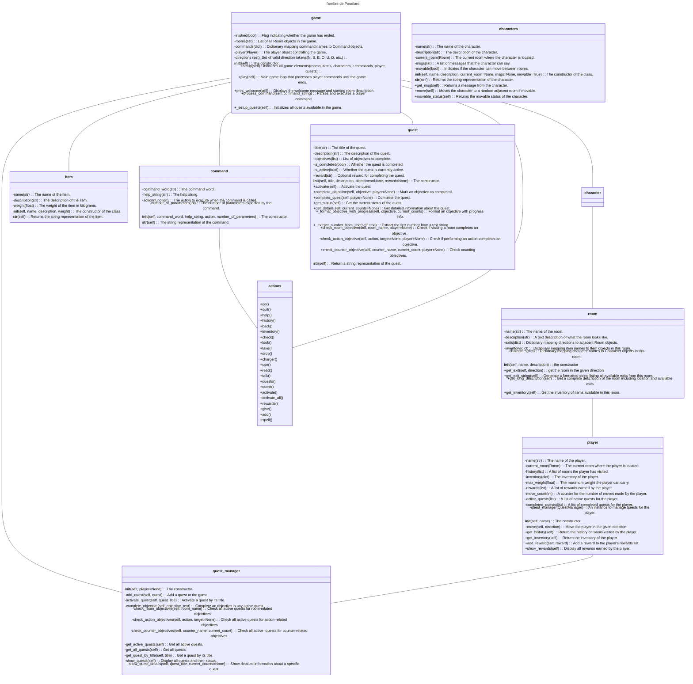

# TBA

Ce repo contient la dernière version du jeu d'aventure TBA l'ombre de Poudlard.

Les lieux sont au nombre de 16. les objets au

## Structuration

Il y a pour le moment 5 modules contenant chacun une classe.

- `game.py` / `Game` : description de l'environnement, interface avec le joueur ;
- `room.py` / `Room` : propriétés génériques d'un lieu  ;
- `player.py` / `Player` : le joueur ;
- `command.py` / `Command` : les consignes données par le joueur ;
- `actions.py` / `Action` : les interactions entre .

## Diagramme 

